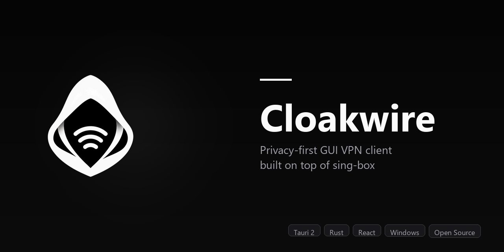

<div align="center">


# Cloakwire

**Privacy-first GUI VPN client built on top of [sing-box](https://github.com/SagerNet/sing-box).**

Tauri 2 + React + TypeScript, styled after [classquiz](https://classquiz.ru).

[](https://github.com/markwhite7881-cpu/cloakwire/releases/latest)
[](https://github.com/markwhite7881-cpu/cloakwire/releases/latest)
[](LICENSE)
[](https://github.com/markwhite7881-cpu/cloakwire/stargazers)

</div>

> 🇷🇺 **Русская версия:** [README.md](README.md)

---



---

## 🎯 What is this

**Cloakwire** is a minimalistic GUI VPN client for Windows that wraps the power of [sing-box](https://github.com/SagerNet/sing-box) in a clean, opinionated interface. Full protocol stack (VLESS, VMess, Trojan, Shadowsocks, Hysteria2, TUIC), auto-updates and the sing-box core in one binary.

**The idea:** pick the apps that should go through the VPN — everything else stays direct. No complex rules, no manual config.

---

## ✨ Why Cloakwire

| | |
|---|---|
| 🚀 **Fast start** | Subscription or share-link → ready in a minute |
| 🎯 **Per-app routes** | "Telegram via VPN, banking app direct" — one chip |
| 🔄 **Auto-updates** | Both the shell and the sing-box core update themselves |
| 🛡️ **Full sing-box** | VLESS, VMess, Trojan, SS, Hysteria2, TUIC |
| 🪶 **Lightweight** | 7 MB portable, minimal dependencies |
| 🎨 **Minimalist UI** | Dark theme, one glance is all it takes |
| 🔓 **Open Source** | MIT, no trackers, no telemetry |

---

## 📥 Install

### Download a prebuilt binary (recommended)

Head to **[Releases → Latest](https://github.com/markwhite7881-cpu/cloakwire/releases/latest)** and grab:

- **`Cloakwire_1.0.x_x64-setup.exe`** (16 MB) — NSIS installer, recommended
- **`Cloakwire_1.0.x_x64_en-US.msi`** (27 MB) — MSI for enterprise deployment
- **`Cloakwire-1.0.x-portable.exe`** (7.4 MB) — portable, no install

> 💡 **Note:** Windows SmartScreen may warn about an unknown publisher. Click "More info" → "Run anyway" — this is normal for unsigned open-source apps.

### Build from source

```powershell
# Requirements: Node 20+, Rust 1.77+, Tauri CLI (npm i -g @tauri-apps/cli)
git clone https://github.com/markwhite7881-cpu/cloakwire.git
cd cloakwire
npm install
npm run tauri:build
# Artifacts: src-tauri\target\release\bundle\{msi,nsis}\
```

Portable exe: `src-tauri\target\release\cloakwire.exe`

---

## 🚀 First run

1. Launch Cloakwire (will request admin rights for TUN mode)
2. **Servers** → paste a share-link (`vless://...`) or subscription URL → **Add**
3. **Routing** → add programs to "Apps via VPN" (e.g. `telegram.exe`)
4. **Config** → make sure **Tunnel mode = TUN**
5. **Home** → press the big power button

Done. All traffic from the selected apps goes via VPN, the rest stays direct.

---

## 🖼️ Screenshots

> Screenshots are coming soon — we'll add them in v1.0.3+.

In words:
- **Header:** Cloakwire logo + version + sing-box core status
- **Home:** big Start/Stop button, live traffic graph, updates card
- **Servers:** subscriptions list + manual profiles, drag-and-drop, latency ping
- **Routing:** top — two process-pickers ("Apps via VPN" / "Apps direct"), below — Advanced (full rule editor, drag-and-drop, presets, rule-sets)
- **Config:** TUN / system proxy / both modes, DNS, generated `config.json` preview
- **Logs:** live sing-box tail with filter

---

## 🏗️ Architecture

```
┌──────────────────────┐
│  React + Tailwind    │  ← tauri::invoke for everything
│  (src/)              │
└──────────┬───────────┘
           │ tauri::invoke  (typed commands)
┌──────────▼───────────┐
│  Rust + Tauri 2      │  ← CLI / sign / process / tun / log / updater
│  (src-tauri/src/)    │
└──────────┬───────────┘
           │ std::process::Command
┌──────────▼───────────┐
│  sing-box            │  ← VLESS / VMess / Trojan / SS / Hy2 / TUIC, TUN, route
│  (binaries/)         │
└──────────────────────┘
```

**Layers:**
1. **Frontend** — React + TypeScript + Tailwind, classquiz design tokens
2. **Tauri shell** — Rust wrapper: process commands, auto-updates, logging, TUN management
3. **sing-box core** — the VPN protocol itself, config generated from the UI structure

---

## 🛠️ Stack

| Layer | Tech |
|------|------|
| Shell | **Tauri 2** (Rust + WebView) |
| UI | **React 18** + **TypeScript 5** |
| Styling | **Tailwind CSS 3** + shadcn-style design tokens |
| VPN core | [**sing-box**](https://github.com/SagerNet/sing-box) 1.10+ (sidecar) |
| Drag-and-drop | **@dnd-kit/sortable** |
| Icons | **lucide-react** |
| Auto-updates | `tauri-plugin-updater` + `tauri-plugin-process` (Ed25519 minisign) |
| Process enum | `sysinfo` crate |
| Signer | Custom `tauri-signer` crate (see below) |

---

## 📦 Development stages

| Stage | Status | Notes |
|-------|--------|-------|
| 1. Tauri scaffold + sidecar | ✅ | Spawn/stop, log streaming, health-check, default config |
| 2. Protocol link parser | ✅ | vless / vmess / trojan / ss / hy2 / tuic |
| 3. Config generator | ✅ | TUN inbound, route rules, selector/urltest, `sing-box check` clean |
| 4. Clash API | ✅ | list/select/test_delay over HTTP |
| 5. Server list + traffic chart | ✅ | WebSocket traffic stream, SVG sparklines |
| 6. Subscription auto-refresh | ✅ | Fetch + parse + per-line errors + auto-refresh tick |
| 7. Routing + autostart | ✅ | Geosite/geoip presets (ads/CN/RU/QUIC) + Windows autostart |
| 8. v1.0.0 + auto-update | ✅ | Tauri updater (Ed25519), sing-box core auto-update |

---

## 🔐 Security

- **Ed25519 minisign** for update signatures (Tauri updater + our `tauri-signer`)
- **No telemetry**, no analytics, no phone-home beyond the update check
- **Local settings** in `%APPDATA%\ru.classquiz.singbox\` (Tauri `app_data_dir`)
- **Hardened WebView** with CSP = null only for dev convenience (review in production build)
- **Open source** — every line of code is visible

---

## 🧪 Stage 1 smoke test

Minimal check that sing-box is alive:

```powershell
# Launch Cloakwire once — it unpacks sing-box into %APPDATA%\ru.classquiz.singbox\binaries\
Get-Process sing-box
# Should show a running process
```

---

## 🤝 Contributing

PRs are welcome. For big changes, please open an issue first so we can discuss.

- **Code style:** `cargo fmt` for Rust, `prettier` for TS/TSX (`npm run build` checks)
- **Tests:** `cargo test --lib` (56 unit tests for config generator and parser)
- **Commits:** conventional commits help (`feat:`, `fix:`, `chore:`)

---

## 🛠️ Why a custom signer

`npx tauri signer sign` hangs on Windows after "Signing without password." (TTY detection in tauri-cli is broken). We built an `tauri-signer` crate that uses the same `minisign = "0.9"` as upstream but skips the interactive prompt. Source: `src-tauri/crates/tauri-signer/`.

---

## 📜 License

[MIT](LICENSE) — do what you want, just credit the authors.

---

## 🙏 Thanks

- [**SagerNet/sing-box**](https://github.com/SagerNet/sing-box) — the fastest, most flexible VPN core out there
- [**Tauri**](https://tauri.app) — a desktop app shell that doesn't get in your way
- [**classquiz**](https://classquiz.ru) — design system inspiration

---

<div align="center">

**[⬇ Download latest](https://github.com/markwhite7881-cpu/cloakwire/releases/latest)** · **[🐛 Report a bug](https://github.com/markwhite7881-cpu/cloakwire/issues)** · **[⭐ Star this repo](https://github.com/markwhite7881-cpu/cloakwire)**

Made with care for people who value their privacy.

</div>
