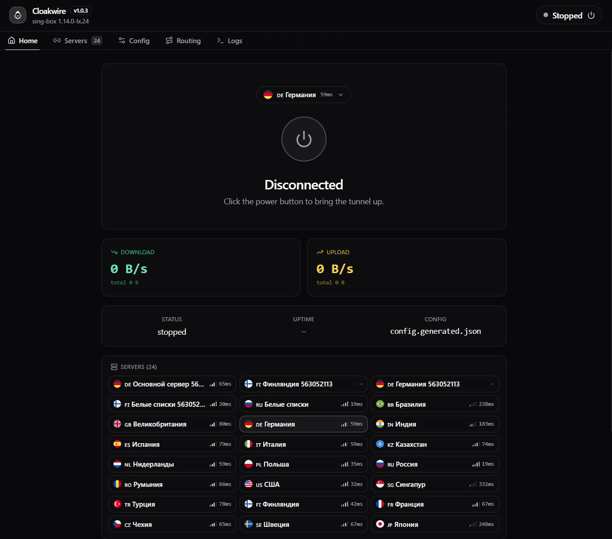
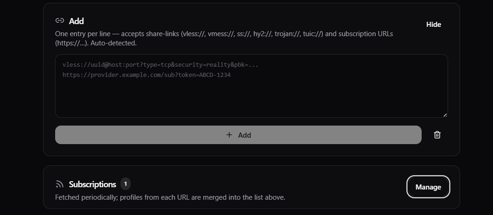
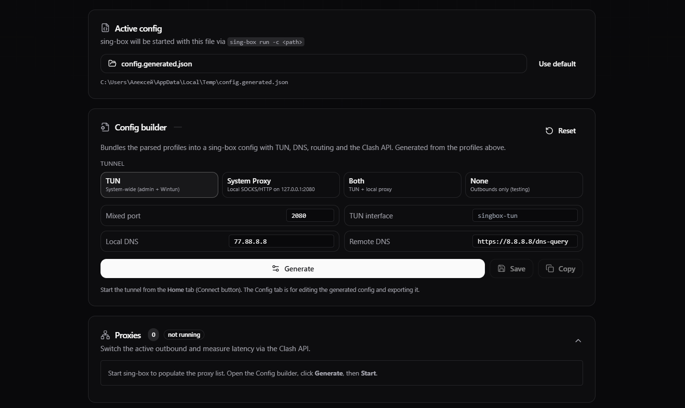
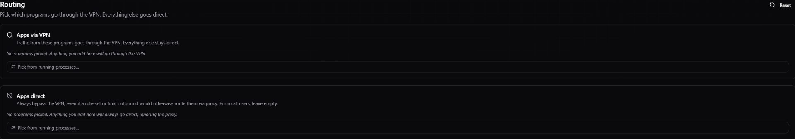
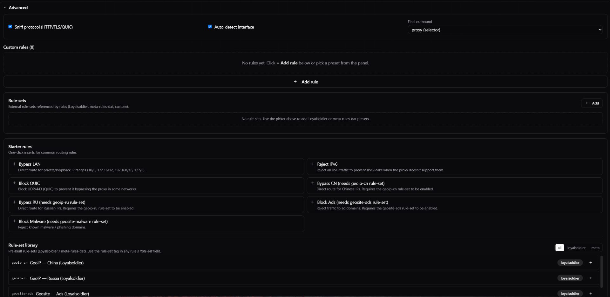

<div align="center">


# Cloakwire

**Privacy-first desktop VPN client with sing-box as its primary core and Xray as a capability fallback.**

Tauri 2 + React + TypeScript.

[](https://github.com/markwhite7881-cpu/cloakwire/releases/latest)
[](https://github.com/markwhite7881-cpu/cloakwire/releases/latest)
[](LICENSE)
[](https://github.com/markwhite7881-cpu/cloakwire/stargazers)

</div>

> 🇬🇧 **English version:** [README.en.md](README.en.md)

---

## 🎯 Что это такое

**Cloakwire** — минималистичный desktop VPN-клиент для Windows, macOS и Linux. Он принимает share-links и подписки, сохраняет конфигурации локально и запускает профиль в понятном интерфейсе без ручного редактирования JSON.

**sing-box — основной движок.** Он используется для обычных поддерживаемых профилей, TUN, System Proxy, маршрутизации по приложениям, выбора прокси и встроенных проверок задержки.

**Xray — резервный движок по возможностям.** Если подписка содержит профиль, который безопаснее или корректнее исполнять через Xray, Cloakwire подготавливает и запускает его автоматически. При этом Home сохраняет статус, выбранный сервер и live-метрики. Управление proxy-группами и встроенные delay-тесты доступны только при активном sing-box — это ограничение намеренное, а не ошибка интерфейса.

### Управляйте маршрутом, а не настройками сети

**Apps via VPN.** Выберите браузер, игру, мессенджер или другое приложение — только их соединения пойдут через VPN-туннель. Остальной трафик продолжит работать напрямую.

**Apps direct.** Или наоборот: направьте через VPN системный трафик и оставьте прямое соединение только для выбранных приложений — например, банковских клиентов, корпоративных сервисов или программ в локальной сети.

---

## ✨ Возможности

| | |
|---|---|
| 🚀 **Быстрый старт** | Share-link или подписка → профиль готов к подключению |
| 🧩 **Два движка** | sing-box — основной; Xray — автоматический fallback для совместимых профилей |
| 🎯 **Per-app маршруты** | «Telegram через VPN, банк напрямую» — в одном интерфейсе |
| 🗂️ **Подписки без утечек** | Подписки разбираются в backend; URL и содержимое профилей не передаются WebView |
| 🧭 **Понятный Home** | Серверы одной подписки сгруппированы, названия провайдера используются как fallback |
| 🔄 **Безопасное переподключение** | При смене сервера или рабочих Config/Routing-настроек активный VPN переподключается автоматически |
| 📈 **Live-статус** | Состояние соединения, трафик и информация о текущем движке |
| 🔓 **Open Source** | MIT, без аналитики и телеметрии |

Поддерживаемые link-протоколы включают VLESS, VMess, Trojan, Shadowsocks, Hysteria2 и TUIC. Реальная совместимость конкретного профиля определяется его параметрами и выбранным движком.

---

## 📥 Установка

Скачивайте файлы из **[Releases → Latest](https://github.com/markwhite7881-cpu/cloakwire/releases/latest)**. Ниже перечислен состав текущего релиза `v1.3.1`.

### Windows x64

- **`Cloakwire_1.3.1_x64-setup.exe`** — NSIS-установщик.

> ⚠️ Установщик `v1.3.1` не подписан Authenticode. Windows SmartScreen может показать предупреждение о неизвестном издателе. Скачивайте файл только из GitHub Releases и сверяйте SHA-256 с `SHA256SUMS.txt`.

### macOS

Выберите сборку по архитектуре процессора:

| Mac | Файлы |
|---|---|
| Intel | `Cloakwire_1.3.1_x64.dmg` или `Cloakwire_1.3.1_x64.app.zip` |
| Apple Silicon | `Cloakwire_1.3.1_aarch64.dmg` или `Cloakwire_1.3.1_aarch64.app.zip` |

> ⚠️ Сборки `v1.3.1` не подписаны и не notarized. macOS может потребовать явного разрешения на запуск в настройках Privacy & Security.

### Linux x64 — Ubuntu / Debian

Установите пакет:

```bash
sudo apt install ./Cloakwire_1.3.1_amd64.deb
cloakwire
```

Пакет устанавливает `/usr/bin/cloakwire`, `sing-box` и Xray. Его `postinst` выдаёт `sing-box` capability `cap_net_admin,cap_net_raw=+ep`, необходимую для TUN-режима:

```bash
getcap /usr/bin/sing-box
# ожидается: /usr/bin/sing-box cap_net_admin,cap_net_raw=ep
```

Если capability была сброшена обновлением или ручным изменением прав, восстановите её:

```bash
sudo setcap cap_net_admin,cap_net_raw=+ep /usr/bin/sing-box
```

Linux-сборка рассчитана на Ubuntu 22.04+ и Debian 12+ desktop. TUN рекомендуется: он перехватывает трафик на сетевом уровне и не зависит от proxy-поддержки конкретного приложения.

### Проверка загрузки

В каждый релиз входит `SHA256SUMS.txt`. Перед установкой можно проверить файл так:

```powershell
Get-FileHash .\Cloakwire_1.3.1_x64-setup.exe -Algorithm SHA256
```

Сравните результат со строкой для нужного файла в `SHA256SUMS.txt`.

---

## 🚀 Первый запуск

1. Запустите Cloakwire. Для TUN-режима могут потребоваться права администратора.
2. В **Servers** вставьте share-link (`vless://…`) или URL подписки и нажмите **Add**.
3. В **Routing** добавьте программы в **Apps via VPN** или **Apps direct**.
4. В **Config** выберите режим туннеля — обычно **TUN**.
5. На **Home** выберите сервер и нажмите большую кнопку питания.

Если VPN уже запущен, выбор другого сервера и изменение применимых настроек сопровождаются безопасным переподключением. Сообщение в интерфейсе остаётся видимым, пока переподключение выполняется или требуется повторная попытка.

---

## 🖼️ Интерфейс

### Home — главный экран

Группы серверов подписки, выбранный профиль, статус активного движка, live Download/Upload и задержка серверов до подключения.



### Servers — профили и подписки

Поддерживаются share-links и подписки в URL, base64 и Clash YAML. Формат определяется автоматически; для безымянных подписок используется название провайдера из метаданных.



### Config — режимы туннеля и DNS

Четыре режима: **TUN**, **System Proxy**, **Both** и **None**. Отдельные поля для локального и удалённого DNS.



### Routing — простой и расширенный режимы

В простом режиме доступны **Apps via VPN** и **Apps direct**. В Advanced можно настроить custom rules, rule-sets, sniffing, auto-detect interface и final outbound.





---

## 🏗️ Архитектура

```text
┌──────────────────────┐
│ React + Tailwind     │  ← typed tauri::invoke
│ src/                 │
└──────────┬───────────┘
           │
┌──────────▼───────────┐
│ Rust + Tauri 2       │  ← subscriptions, routing, lifecycle, safe IPC
│ src-tauri/src/       │
└──────────┬───────────┘
           │ process lifecycle
┌──────────▼───────────────────────────┐
│ sing-box (primary)  │ Xray (fallback) │
│ TUN / proxy control │ compatible      │
│ Clash API / delay   │ profile runtime │
└──────────────────────────────────────┘
```

1. **Frontend** — React + TypeScript + Tailwind. Он получает только безопасные данные, нужные интерфейсу.
2. **Tauri shell** — Rust-слой для подписок, генерации runtime-конфигураций, процесса, маршрутизации, DNS и обновлений.
3. **VPN runtime** — sing-box используется по умолчанию; Xray запускается для классифицированных fallback-профилей. Одновременно работает только один движок.

---

## 🛠️ Стек

| Слой | Технология |
|---|---|
| Shell | **Tauri 2** (Rust + WebView) |
| UI | **React 18** + **TypeScript 5** |
| Стили | **Tailwind CSS 3** + design tokens |
| Основное VPN-ядро | [**sing-box**](https://github.com/SagerNet/sing-box) sidecar |
| Fallback-ядро | [**Xray-core**](https://github.com/XTLS/Xray-core) sidecar |
| Маршрутизация | sing-box rules / rule-sets + process routing |
| Автообновление приложения | инфраструктура Tauri updater; подписанные updater-артефакты публикуются отдельно, когда доступны |
| Обновление runtime | managed update существует для sing-box; автоматическое обновление Xray намеренно не включено |

---

## 🔐 Безопасность и границы данных

- URL подписок, содержимое профилей, UUID/ключи и runtime-пути не отдаются в WebView.
- Xray runtime-конфигурация и его stdout/stderr остаются на backend-стороне.
- При активном Xray интерфейс не пытается вызывать sing-box Clash API для списка/выбора прокси или delay-тестов.
- Нет продуктовой телеметрии и аналитики.
- Обновления и загружаемые артефакты должны проверяться по SHA-256; для новых релизов используйте `SHA256SUMS.txt`.

---

## 🧑‍💻 Сборка из исходников

```powershell
# Требования: Node 20+, Rust stable, зависимости Tauri для целевой платформы
git clone https://github.com/markwhite7881-cpu/cloakwire.git
cd cloakwire
npm ci
npm run tauri:build
```

Для сборки Linux `.deb` используйте Ubuntu 22.04+ / Debian 12+ (либо WSL2) и скрипт:

```bash
./scripts/build-linux-deb.sh 1.3.1
```

`postinst` в итоговом `.deb` устанавливает capability только для `sing-box`, так как именно он реализует поддерживаемый TUN-путь Linux.

---

## 🤝 Contributing

PR-ы приветствуются. Для крупных изменений сначала откройте issue, чтобы обсудить направление.

- **Code style:** `cargo fmt` для Rust, Prettier для TS/TSX.
- **Проверки:** `npm test`, затем production build; проверяйте артефакты до публикации.
- **Коммиты:** conventional commits (`feat:`, `fix:`, `docs:`, `chore:`).

---

## 📜 Лицензия

[MIT](LICENSE) — делайте что хотите, но упомяните авторов.

---

## 🙏 Благодарности

- [**SagerNet/sing-box**](https://github.com/SagerNet/sing-box)
- [**XTLS/Xray-core**](https://github.com/XTLS/Xray-core)
- [**Tauri**](https://tauri.app)

---

<div align="center">

**[⬇ Скачать последнюю версию](https://github.com/markwhite7881-cpu/cloakwire/releases/latest)** · **[🐛 Сообщить о баге](https://github.com/markwhite7881-cpu/cloakwire/issues)** · **[⭐ Поставить звезду](https://github.com/markwhite7881-cpu/cloakwire)**

Made with care for people who value their privacy.

</div>
